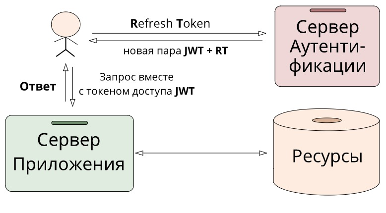

# Refresh token rotation

1. Виды токенов

### Токены доступа (JWT) — это токены, с помощью которых можно получить доступ к защищенным ресурсам. Они короткоживущие, но многоразовые. В них может содержаться дополнительная информация, например, время жизни или IP-адрес, откуда идет запрос. Все зависит от желания разработчика.
### Рефреш токен (RT) — эти токены выполняют только одну специфичную задачу — получение нового токена доступа. И на этот раз без сервера авторизации не обойтись. Они долгоживущие, но одноразовые.

###  Основной сценарий использования такой: как только старый JWT истекает, то с ним мы уже не можем получить приватные данные, тогда отправляем RT и нам приходит новая пара JWT+RT. С новым JWT мы снова можем обращаться к приватным ресурсам. Конечно, рефреш токен тоже может протухнуть, но случится это не скоро, поскольку живет он намного дольше своего собрата

 

#### Functionality of refresh token rotation creating steps:

-  Summary made by articleS:

https://jasonwatmore.com/net-6-jwt-authentication-with-refresh-tokens-tutorial-with-example-api

 https://habr.com/ru/articles/466929/:
 

## links to boost security-related skills 

https://stackoverflow.com/questions/3487991/why-does-oauth-v2-have-both-access-and-refresh-tokens

https://stackoverflow.com/questions/38986005/what-is-the-purpose-of-a-refresh-token